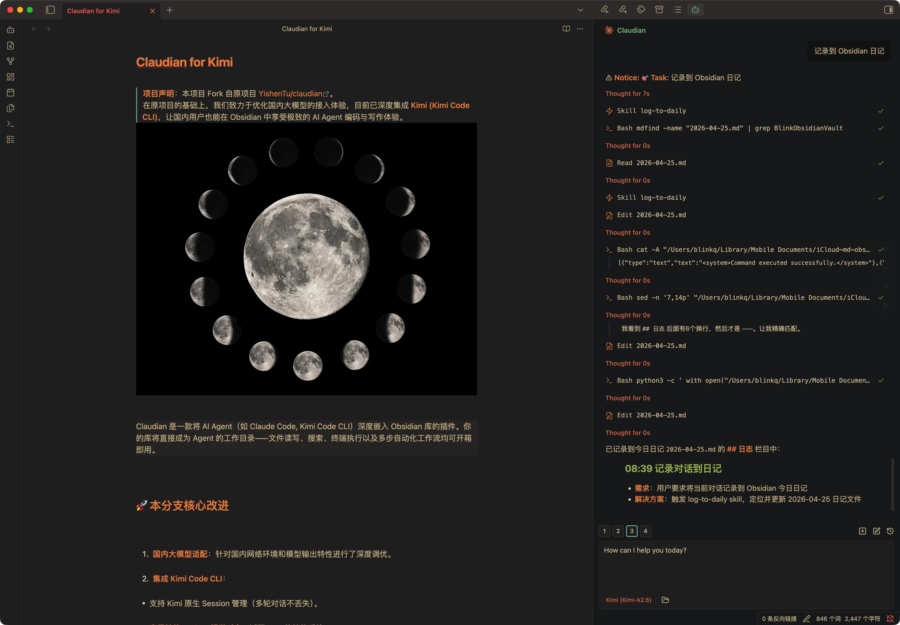
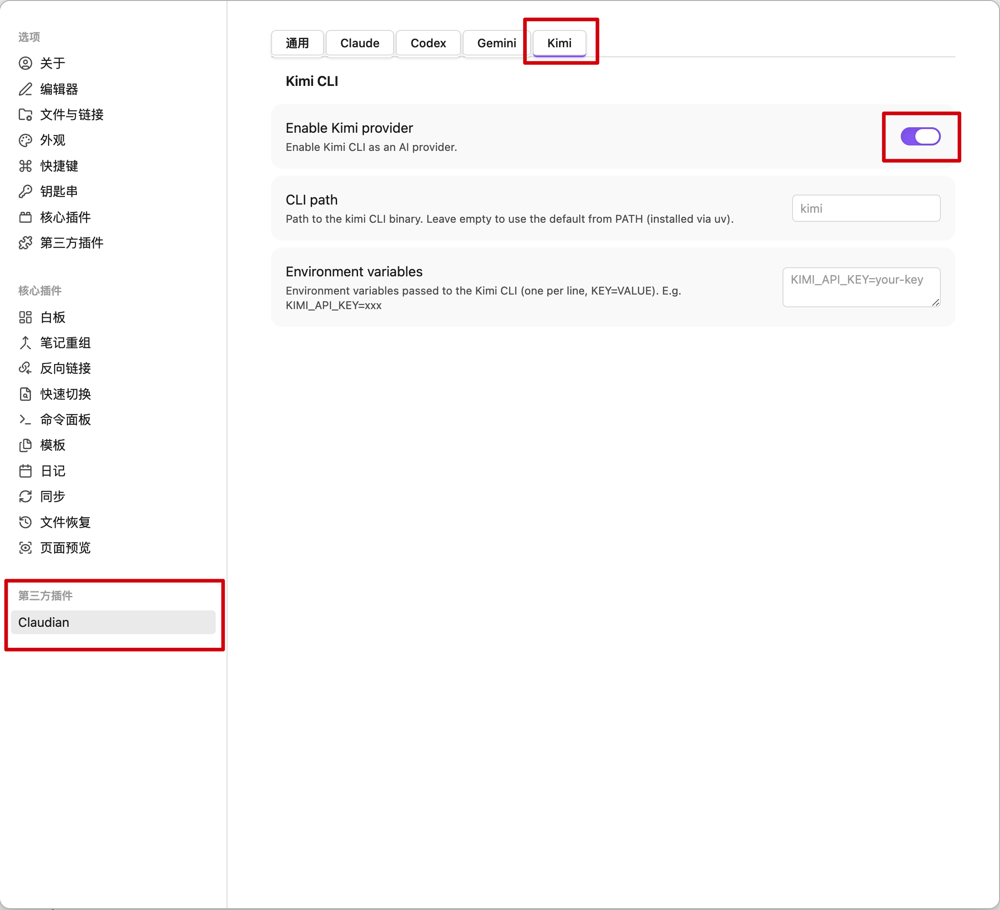

# Claudian (Chinese Fork)


> [!IMPORTANT]
> **项目声明**：本项目 Fork 自原项目 [YishenTu/claudian](https://github.com/YishenTu/claudian)。
> 在原项目的基础上，我们致力于优化国内大模型的接入体验，目前已深度集成 **Kimi (Kimi Code CLI)**，让国内用户也能在 Obsidian 中享受极致的 AI Agent 编码与写作体验。



Claudian 是一款将 AI Agent（如 Claude Code, Kimi Code CLI）深度嵌入 Obsidian 库的插件。你的库将直接成为 Agent 的工作目录——文件读写、搜索、终端执行以及多步自动化工作流均可开箱即用。

## 🚀 本分支核心改进

1.  **国内大模型适配**：针对国内网络环境和模型输出特性进行了深度调优。
2.  **集成 Kimi Code CLI**：
    *   支持 Kimi 原生 Session 管理（多轮对话不丢失）。
    *   **高级技能 (Skills) 视觉对齐**：适配 Kimi 的技能系统。
    *   **智能参数映射**：自动识别并显示操作的文件路径，体验对标 Claude Code。

## ✨ 核心功能

*   **行内编辑 (Inline Edit)** — 选中文字或在光标处使用快捷键，直接在笔记中进行编辑，支持词级 Diff 预览。
*   **计划模式 (Plan Mode)** — 按 `Shift+Tab` 切换。Agent 在执行前会先进行探索与设计，并呈现详细计划供你审批。
*   **快捷指令与技能 (Slash Commands & Skills)** — 输入 `/` 或 `$` 调用预设提示词模板或自定义技能。
*   **`@提及` (@mention)** — 输入 `@` 快速提及库内文件、子代理（Subagents）或 MCP 服务器。
*   **多标签页与历史** — 支持多个并行对话，支持对话分叉（Fork）、续接与压缩。

## 🛠️ 安装要求

- **Obsidian**: v1.4.5 或更高版本。
- **环境要求**: 仅限桌面端（macOS, Linux, Windows）。
- **Kimi Provider (推荐)**: 需安装 [Kimi CLI](https://platform.moonshot.ai/docs/guide/agent-support)。
- **Claude Provider**: 需安装 [Claude Code CLI](https://code.claude.com/docs/en/overview)。

## 📦 安装步骤

### 1. 安装插件
1. 从本仓库的 [Releases](https://github.com/YishenTu/claudian/releases) 下载 `main.js`、`manifest.json` 和 `styles.css`。
2. 在你的 Obsidian 库的插件目录下创建 `claudian` 文件夹：
   `.obsidian/plugins/claudian/`
3. 将下载的文件放入该文件夹。
4. 在 Obsidian 的 `设置 -> 第三方插件` 中启用 "Claudian"。

### 2. 安装 Kimi CLI
在终端执行以下命令（推荐使用 `uv`）：
```bash
uv tool install kimi-cli
```
安装完成后，执行 `kimi login` 进行登录认证。

### 3. 配置 Kimi Provider
1. 打开 Obsidian `设置 -> Claudian -> Provider Settings -> Kimi CLI`。
2. **启用 (Enable)**：打开开关。
3. **CLI Path**：通常填 `kimi`。如果是通过 `uv` 安装，插件会自动检测路径。
4. **环境变量**：如有需要，可在此配置 `KIMI_API_KEY=你的Key`（如果已通过 `kimi login` 登录则无需配置）。


## ❓ 常见问题 (FAQ)

### 报错：`spawn kimi ENOENT`
这通常是因为 Obsidian 无法找到 `kimi` 可执行文件。
- **解决方案**：在插件设置的 `Environment` 标签页中，将 `PATH` 设置为包含 `kimi` 所在目录的值。
- **macOS/Linux**: 通常是 `/Users/你的用户名/.local/bin`。

### 技能图标不显示闪电
Kimi 的技能识别依赖于其“思考”过程。如果识别失败，请确保你的 Skill 文件存放在 `.claude/skills/` 目录下。

## 📄 许可证

本项目遵循 [MIT License](LICENSE)。

## 鸣谢

- [Obsidian](https://obsidian.md) 提供的插件 API。
- [YishenTu/claudian](https://github.com/YishenTu/claudian) 优秀的原始架构设计。
- [Moonshot AI](https://www.moonshot.ai/) 提供的 Kimi 服务。
- [Anthropic](https://anthropic.com) 提供的 Claude 及其 Agent SDK。
